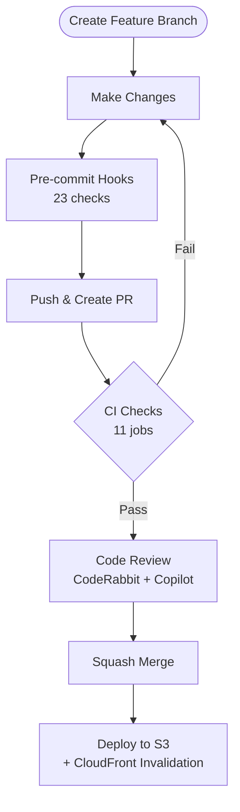

# Professional Profile Website


Personal professional profile and resume website hosted at
[alexgarcia.info](https://alexgarcia.info).

## Features

- Responsive design (mobile, tablet, desktop)
- Automatic dark mode via `prefers-color-scheme` (no JavaScript needed)
- Multi-language support (English, Spanish, Portuguese)
- PDF download via browser print
- Custom 404 error page

## Architecture

| Resource | Description |
| --- | --- |
| S3 Bucket | `alexgarcia.info` — private, CloudFront OAC access only |
| CloudFront | CDN with HTTPS redirect, HTTP/2+3, custom error pages |
| Route 53 | DNS management for `alexgarcia.info` |
| ACM | SSL/TLS certificate (us-east-1) |

Infrastructure is managed in a separate repo:
[professional-profile-iac](https://github.com/gamaware/professional-profile-iac).

## Local Development

```bash
# 1. Install pre-commit hooks (23 checks)
pre-commit install
vale sync

# 2. Open in browser — no build step required
# macOS:   open index.html
# Linux:   xdg-open index.html
# Windows: start index.html

# 3. Verify all checks pass
pre-commit run --all-files
```

## Development Workflow



## CI/CD Pipeline

| Workflow | Trigger | Purpose |
| --- | --- | --- |
| `quality-checks.yml` | Every PR and push | Quality, security, and Lighthouse checks (see workflow for full job list) |
| `deploy.yml` | Push to main | Sync to S3, invalidate CloudFront, verify deployment |

## Repository Structure

```text
index.html                 # Main resume page
style.css                  # Stylesheet (dark mode, responsive)
main.js                    # Language selector and PDF download
error.html                 # Custom 404 page
headshot.jpg               # Profile photo
CLAUDE.md                  # Claude Code project instructions
CONTRIBUTING.md            # Contribution guidelines
SECURITY.md                # Security disclosure policy
.claude/                   # Claude Code hooks and skills
.github/                   # CI/CD, templates, dependabot
docs/adr/                  # Architecture Decision Records
```

## Defense in Depth

Security checks at every stage of the development lifecycle:

1. **Pre-commit**: detect-secrets, gitleaks, HTMLHint, Stylelint, ESLint, Prettier
2. **PR CI**: HTMLHint, Stylelint, ESLint, markdownlint, Vale, zizmor, Lighthouse
3. **Code Review**: CodeRabbit (auto), Copilot (auto), human (required)
4. **Deploy**: S3 sync, CloudFront invalidation, health check verification

## Quick Links

| Resource | Link |
| --- | --- |
| Live Site | [alexgarcia.info](https://alexgarcia.info) |
| Infrastructure | [professional-profile-iac](https://github.com/gamaware/professional-profile-iac) |
| ADRs | [docs/adr/](docs/adr/README.md) |

## License

[MIT](LICENSE)

## Author

Alex Garcia — [gamaware@gmail.com](mailto:gamaware@gmail.com)
