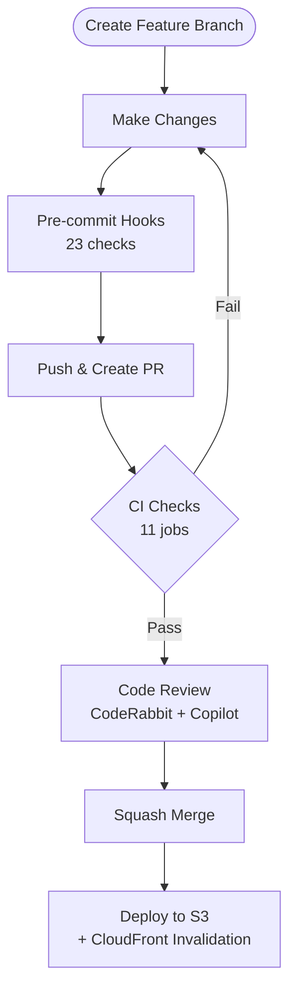

# Professional Profile Website


Personal professional profile and resume website hosted at
[alexgarcia.info](https://alexgarcia.info).

## Features

- Responsive design (mobile, tablet, desktop)
- Automatic dark mode via `prefers-color-scheme` (no JavaScript needed)
- Multi-language support (English, Spanish, Portuguese)
- PDF download via browser print
- Custom 404 error page
- Content visible at first paint, self-hosted fonts, no third-party scripts
- Print stylesheet for an A4 PDF

## Architecture

| Resource | Description |
| --- | --- |
| S3 Bucket | `alexgarcia.info` — private, CloudFront OAC access only |
| CloudFront | CDN with HTTPS redirect, HTTP/2+3, custom error pages |
| Route 53 | DNS management for `alexgarcia.info` |
| ACM | SSL/TLS certificate (us-east-1) |

A separate repo manages the infrastructure:
[professional-profile-iac](https://github.com/gamaware/professional-profile-iac).

## Local Development

```bash
# 1. Install pre-commit hooks and the test/lint tooling
pre-commit install
vale sync
npm ci
npx playwright install chromium

# 2. Preview at http://127.0.0.1:4173 (no build step)
npm run serve

# 3. Run the tests and all checks
npm test                  # unit (node:test + happy-dom) and browser (Playwright) tests
npm run test:smoke        # smoke subset; BASE_URL=https://alexgarcia.info runs it live
pre-commit run --all-files
```

## Testing

| Suite | Location | What it covers |
| --- | --- | --- |
| Unit | `tests/unit/` | `main.js`: language switching, fallback for unknown codes, saved language restore, `html lang`, blocked storage, print button state |
| Functional | `tests/e2e/functional.spec.mjs` | Persistence across reload, labeled and keyboard-operable select, print, links, headshot, console errors, WCAG AA contrast in light and dark mode, print layout |
| Smoke | `tests/e2e/smoke.spec.mjs` | Status 200, content visible at first paint, all three languages, no overflow at 390 px, assets, error page |

Both suites run in the `quality-checks.yml` workflow. `tests/server.mjs` serves the site locally and answers unknown
paths with `error.html` and status 404, like CloudFront.

## Caching

The deploy script sets `Cache-Control` per file type: images and fonts are cached for one year as immutable, HTML,
CSS and JavaScript for five minutes. Give a changed image or font a new file name so visitors get the new version.

## Development Workflow


```mermaid
flowchart TB
    A([Create Feature Branch]) --> B[Make Changes]
    B --> C[Pre-commit Hooks<br/>23 checks]
    C --> D[Push & Create PR]
    D --> E{CI Checks<br/>11 jobs}
    E -->|Pass| F[Code Review<br/>CodeRabbit + Copilot]
    F --> G[Squash Merge]
    E -->|Fail| B
    G --> H[Deploy to S3<br/>+ CloudFront Invalidation]
```

## CI/CD Pipeline

| Workflow | Trigger | Purpose |
| --- | --- | --- |
| `quality-checks.yml` | Every PR and push | Quality, security, and Lighthouse checks (see workflow for full job list) |
| `deploy.yml` | Push to main | Sync to S3, invalidate CloudFront, verify deployment |

## Repository Structure

```text
index.html                 # Main resume page
style.css                  # Stylesheet (dark mode, responsive)
main.js                    # Language selector and PDF download
error.html                 # Custom 404 page
headshot.webp              # Profile photo (headshot.jpg is the JPEG fallback)
favicon.svg                # Favicon (plus apple-touch-icon.png)
fonts/                     # Self-hosted Rokkitt and Lato (OFL)
tests/                     # Unit and Playwright tests, local static server
package.json               # Test and lint tooling only (not deployed)
CONTRIBUTING.md            # Contribution guidelines
SECURITY.md                # Security disclosure policy
.github/                   # CI/CD, templates, dependabot
docs/adr/                  # Architecture Decision Records
```

## Defense in Depth

Security checks at every stage of the development lifecycle:

1. **Pre-commit**: detect-secrets, gitleaks, HTMLHint, Stylelint, ESLint, Prettier
2. **PR CI**: HTMLHint, Stylelint, ESLint, markdownlint, Vale, zizmor, Lighthouse
3. **Code Review**: CodeRabbit (auto), Copilot (auto), human (required)
4. **Deploy**: S3 sync, CloudFront invalidation, health check verification

## Quick Links

| Resource | Link |
| --- | --- |
| Live Site | [alexgarcia.info](https://alexgarcia.info) |
| Infrastructure | [professional-profile-iac](https://github.com/gamaware/professional-profile-iac) |
| ADRs | [docs/adr/](docs/adr/README.md) |

## License

[MIT](LICENSE)

## Author

Alex García — [gamaware@gmail.com](mailto:gamaware@gmail.com) · [GitHub](https://github.com/gamaware)
